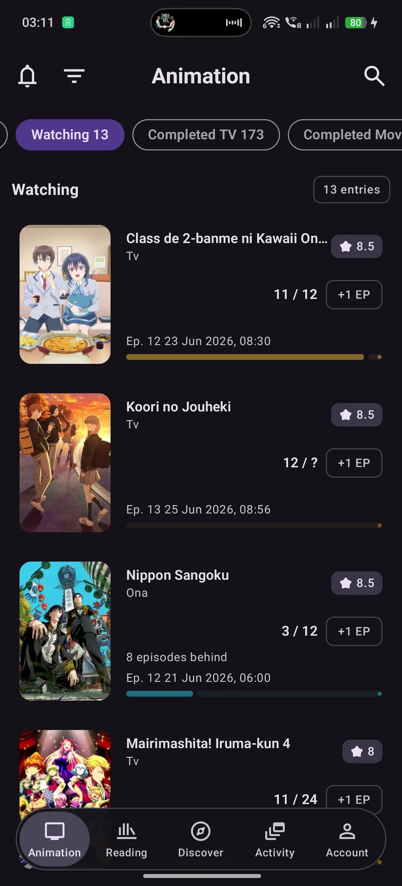
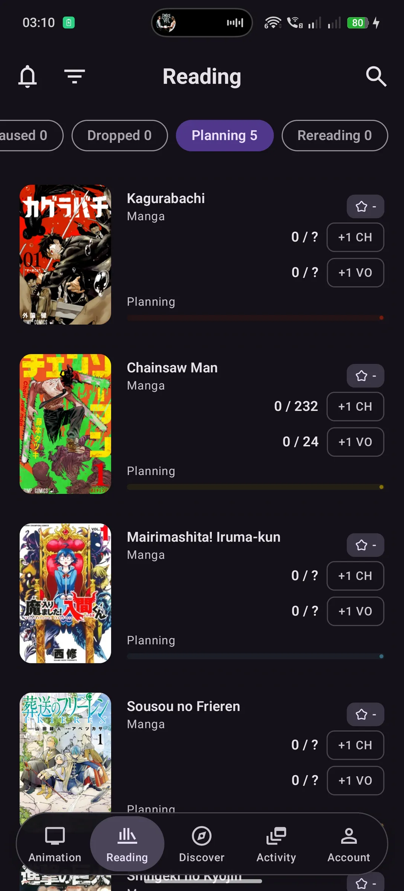
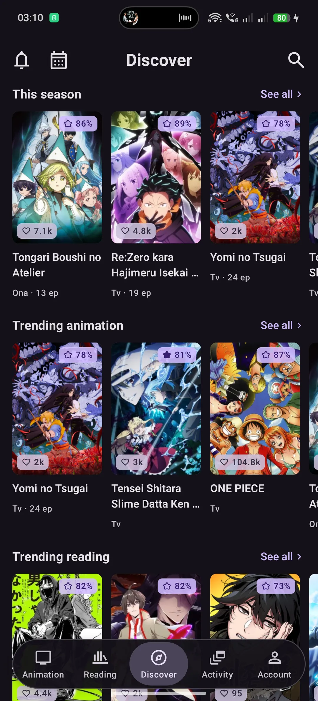
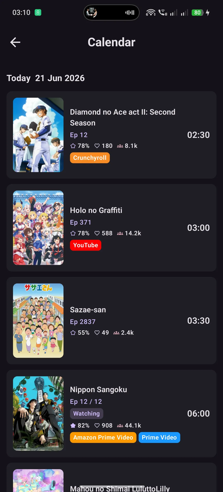
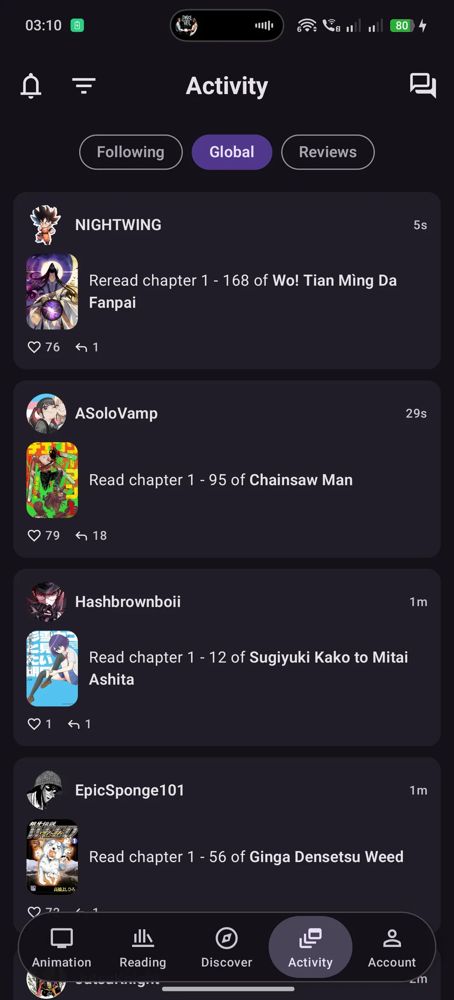
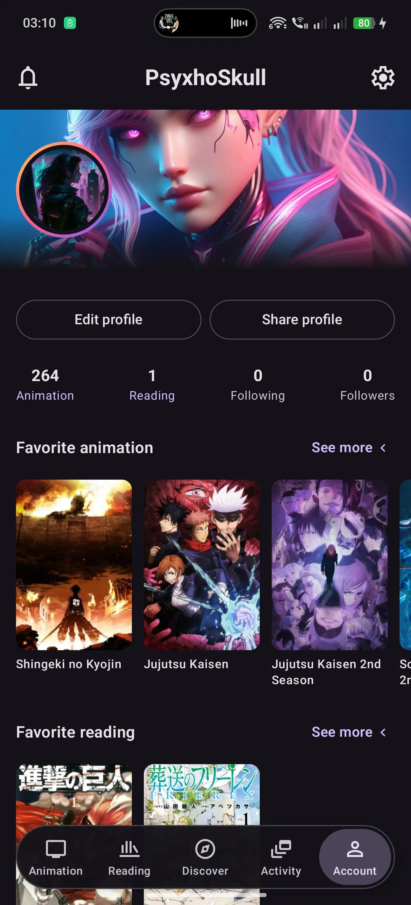
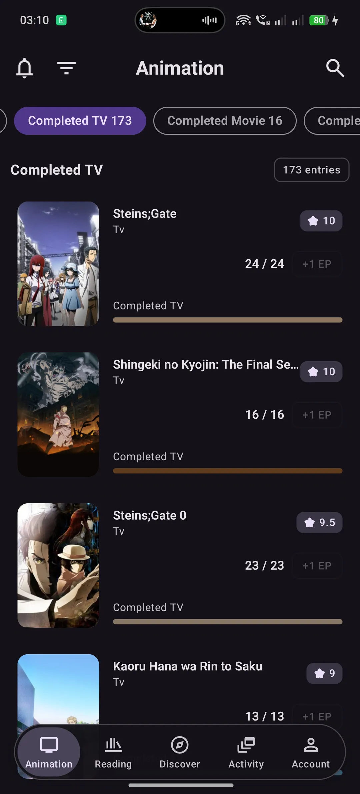

<div align="center">

# Michi

**A modern, fast, unofficial AniList client built with Kotlin Multiplatform.**

*michi* (道) means *"the path"* in Japanese, a companion for your journey through anime and manga. It can also be interpreted as the colloquial way of referring to a cat in Spanish.

</div>

---

## Why michi?

Most existing AniList clients on Android feel dated, sluggish, or visually behind their iOS counterparts. michi started as a personal answer to that: a client that looks current, runs smoothly, and is genuinely pleasant to use, built on a fully modern Kotlin Multiplatform + Compose Multiplatform stack.

It is **unofficial** and **non-commercial**, made for the AniList community, free and open source.

## Screenshots

| Anime list | Manga list | Discover | Calendar |
|:---:|:---:|:---:|:---:|
|  |  |  |  |

| Activity | Profile | Completed list |
|:---:|:---:|:---:|
|  |  |  |

## Features

- **Anime & manga lists:** browse and manage your watching, reading, planning, completed and dropped entries.
- **Profile:** your AniList profile, stats, favorites (media, characters, staff, studios), and a shareable profile QR code.
- **Discover / Explore:** find new titles, trending and seasonal content.
- **Airing calendar:** track what's airing and when.
- **Media detail:** rich detail screens with overview, characters, staff, stats, reviews, threads and related connections.
- **Search:** across anime, manga, characters, staff and studios.
- **Activity feed:** follow community activity and reviews.
- **Bilingual:** full English and Spanish support, switchable in-app.
- **Light & dark themes.**
- **Secure AniList login** via OAuth (implicit grant, no client secret shipped in the app).

## Technologies used

| Layer | Technology |
|---|---|
| Language | **Kotlin 2.3.21** (Multiplatform) |
| UI | **Compose Multiplatform 1.11.0**, Material 3 |
| Networking | **Ktor 3.0.3** client with a custom GraphQL layer over the AniList API |
| Serialization | kotlinx.serialization |
| Images | **Coil 3** |
| Auth | AniList OAuth (implicit grant), Chrome Custom Tabs on Android, Safari on iOS |
| Architecture | Feature-based modules, each split into `data` / `presentation` / `state` layers |

### Architecture highlights

- **18 feature modules of Kotlin** cleanly separated into data, presentation and state layers.
- A **hand-rolled GraphQL client** over Ktor with a typed envelope, `NetworkResult` error handling, and a **client-side rate limiter** that respects AniList's API limits.
- **`expect`/`actual` platform abstractions** for token storage, OAuth launching, clipboard, language settings and system back handling. The shared module holds the logic; platform modules hold the thin native bridges.

## Platform status

- ✅ **Android:** functional, the primary supported target.
- 🏗️ **iOS:** the project is Kotlin Multiplatform from the ground up. Shared business logic, networking, OAuth and platform abstractions (including a Safari-based OAuth launcher and `NSUserDefaults` token storage) are already written in the codebase. The iOS target has not yet been built and polished, so it is not considered usable today.

## Getting started

### Prerequisites

- Android Studio (latest stable) with the Kotlin Multiplatform plugin
- JDK 17+
- An AniList API client. Create one at [anilist.co/settings/developer](https://anilist.co/settings/developer)

### Configuration

michi reads your AniList **client ID** at build time and never commits it to source control. Add it to your `local.properties`:

```properties
anilistClientId=YOUR_ANILIST_CLIENT_ID
```

> Alternatively, set the `ANILIST_CLIENT_ID` environment variable.
>
> When registering your AniList client, set the redirect URI to exactly: `michi://oauth/callback`

A release build will **fail fast** if no client ID is configured, so a shipped binary never bakes in an empty value. Debug builds are allowed to run without it for day-to-day development.

### Run

```bash
# Android (debug)
./gradlew :androidApp:assembleDebug
```

### Tests

```bash
./gradlew :shared:testAndroidHostTest
```

## License

This project is licensed under the **GNU General Public License v3.0**. See the [LICENSE](./LICENSE) file for details.

michi is an unofficial, non-commercial client and is not affiliated with or endorsed by AniList.
